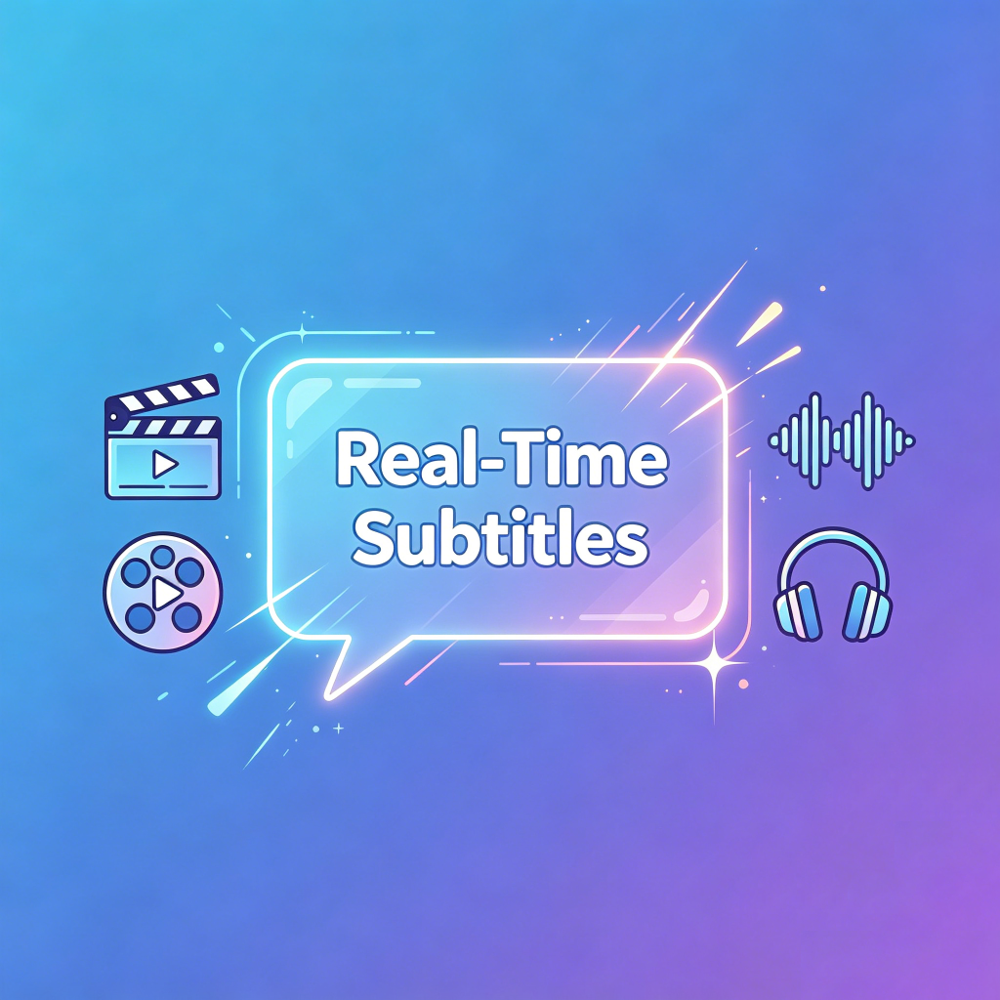

<p align="center"></p>

# Subtitle Overlay

Real-time speech-to-text subtitles from your Mac's system audio. Captures audio from any application, transcribes it on-device, and displays subtitles in a floating overlay — with optional machine translation.

**Keywords:** speech recognition, real-time transcription, system audio capture, on-device ASR, floating subtitles, ScreenCaptureKit, Apple Neural Engine, offline captions, language learning, machine translation, macOS accessibility, live captioning, SFSpeechRecognizer, TranslationSession, whisper.cpp

English | [简体中文](README_CN.md)


## Features

### Speech Recognition (Audio → Text)

- **Per-app system audio capture** — select any running app (browser, video player, conferencing tool); captures its audio via ScreenCaptureKit without affecting other system sounds
- **Real-time on-device transcription** — low-latency speech-to-text using Apple Speech framework with Apple Neural Engine; partial results stream continuously as you hear them
- **Dual recognition engine** — Apple Speech (default, zero-setup, 50+ languages) or Whisper (custom GGML model import via whisper.cpp)
- **Multi-language recognition** — choose from 14 recognition languages in Settings, including English (US/UK), Chinese (Mandarin/Cantonese), Japanese, Korean, French, German, Spanish, Portuguese, Russian, Italian, Dutch, and Arabic. Models auto-download on first use

### Machine Translation (Text → Text)

- **On-device translation** — Apple Translation framework runs entirely on the Neural Engine; no network required after model download
- **17 target languages** — choose your translation target in Settings: Chinese (Simplified/Traditional), Japanese, Korean, French, German, Spanish, Portuguese, Russian, Italian, Dutch, Arabic, Thai, Vietnamese, Polish, Turkish, and Indonesian
- **Toggle on/off** — translation can be enabled/disabled from Settings with one click; translated text renders below the original

### Display & UX

- **Floating overlay** — transparent, always-on-top NSPanel that stays visible over fullscreen video; draggable, auto-resizing
- **History lines** — recently spoken lines fade above the current subtitle; adjustable count (1–5 lines)
- **Customizable appearance** — adjustable font size (14–36pt), background opacity (10–90%), and window width
- **100% on-device** — speech recognition and translation run entirely on Apple Silicon; no data leaves your Mac, works offline after model download
- **UI language switching** — English / 中文 interface; switch from Settings (requires restart)

## Requirements

- macOS 26.0 or later
- Apple Silicon Mac
- Speech recognition model for your target language — auto-downloaded by macOS on first use
- Translation models — manually downloaded from System Settings for each language pair (one-time setup)

## Quick Start

1. Open `SubtitleOverlay.xcodeproj` in Xcode
2. Select the **SubtitleOverlay** scheme and your Mac as destination
3. Press **Cmd+R** to build and run
4. Grant Screen Recording and Speech Recognition permissions when prompted

## Usage

1. Play audio in any app (Netflix, YouTube, Zoom, Safari, Chrome, etc.)
2. Select the target app from the dropdown in Subtitle Overlay
3. Click **Start** to begin audio capture and transcription
4. The subtitle overlay appears — drag it anywhere on screen
5. Open Settings (**Cmd+,**) to:
   - Select recognition language and translation target from dropdown pickers
   - Toggle translation on/off
   - Adjust font size, background opacity, and history lines
   - Switch recognition engine or import a Whisper model
   - Change UI language

### Setting Up Translation

On-device translation requires language models downloaded from System Settings:

1. Open **System Settings** → **General** → **Language & Region**
2. Scroll to the bottom → **Translation Languages**
3. Download models for your source language and target language
4. Click **Refresh** in Subtitle Overlay to verify

> Translation models are separate from system language packs. Having a language as your system preferred language does not install its translation model.

## Recognition & Translation — Independent Systems

The app separates **speech recognition** (audio → text) from **machine translation** (text → text). Each can be configured independently through the Settings UI.

### Speech Recognition

| Aspect | Detail |
|--------|--------|
| **Framework** | `Speech` (SFSpeechRecognizer) |
| **Engine options** | Apple Speech (on-device) or Whisper (custom GGML) |
| **How to change language** | Settings → Model tab → Recognition Language dropdown — choose from 14 supported locales |
| **Supported languages** | Arabic, Chinese (Mandarin, Cantonese), Dutch, English (US, UK), French, German, Italian, Japanese, Korean, Portuguese, Russian, Spanish, and more |
| **Model download** | Automatic — macOS downloads the on-device model for your locale on first use |

### Translation

| Aspect | Detail |
|--------|--------|
| **Framework** | `Translation` (TranslationSession) |
| **How to change target** | Settings → Model tab → Translate To dropdown — choose from 17 target languages |
| **Supported target languages** | Arabic, Chinese (Simplified, Traditional), Dutch, French, German, Indonesian, Italian, Japanese, Korean, Polish, Portuguese, Russian, Spanish, Thai, Turkish, Vietnamese |
| **Model download** | Manual — System Settings → General → Language & Region → Translation Languages |

## Architecture

```
 Target App Audio → ScreenCaptureKit → SCStream (16kHz mono PCM)
                                              ↓
                              ┌─── Speech Recognition Layer ───┐
                              │  SFSpeechRecognizer (on-device) │
                              │  or whisper.cpp (custom GGML)   │
                              └────────────┬────────────────────┘
                                           ↓
                                     Recognized Text
                                           ↓
                              ┌─── Translation Layer (optional) ───┐
                              │     TranslationSession (on-device) │
                              └────────────┬───────────────────────┘
                                           ↓
                              ┌─────── Translated Text ───────┐
                              ↓                                ↓
                     ContentView Preview               SubtitlePanelView
                     (live transcription)             (floating overlay)
```

| Layer | Framework | Role |
|-------|-----------|------|
| Audio capture | ScreenCaptureKit | Per-application audio at 16kHz mono, queue depth 1 for minimal latency |
| **Speech recognition** | **Speech** (SFSpeechRecognizer) | On-device ASR via Apple Neural Engine; `.search` task hint for low latency; supports 50+ locales |
| **Translation** | **Translation** (TranslationSession) | On-device NMT via Apple Neural Engine; supports 15+ language pairs |
| Overlay UI | SwiftUI + AppKit | NSPanel (`.nonActivatingPanel`, `.floating` level, borderless) hosting SwiftUI via NSHostingView |

## Project Structure

```
SubtitleOverlay/
├── SubtitleOverlay.xcodeproj/
├── SubtitleOverlay/
│   ├── App/                        # App entry point & delegate
│   ├── Services/                   # AudioCaptureManager, SpeechRecognizer,
│   │                                 TranslationService, WhisperRecognizer
│   ├── UI/                         # ContentView, SettingsView, SubtitlePanelView,
│   │                                 SubtitleWindowController
│   ├── Models/                     # AppSettings, LanguageManager, LanguageOptions
│   ├── Resources/                  # Localizable.xcstrings, entitlements
│   └── Assets.xcassets/            # App icon
├── Info.plist
├── favicon.png
├── LICENSE
├── README.md
└── README_CN.md
```

## Troubleshooting

| Problem | Solution |
|---------|----------|
| No apps in dropdown | Grant Screen Recording permission: System Settings → Privacy & Security → Screen Recording, then relaunch |
| Speech recognition unavailable | Ensure the speech model for your selected language is downloaded: System Settings → Privacy & Security → Speech Recognition |
| Translation not appearing | Enable "Show Chinese Translation" in Settings; download translation models from System Settings → General → Language & Region → Translation Languages; click Refresh |
| Translation shows "Models not installed" | Translation models ≠ system language packs. Scroll to the bottom of Language & Region → Translation Languages section |
| No audio captured | Confirm the target app is playing audio and its window is visible on screen |
| Subtitles lag behind audio | Reduce `queueDepth` in AudioCaptureManager (default: 1); ensure `.search` task hint is set |

## License

Copyright (c) 2025 SweelLong. See [LICENSE](LICENSE) for full terms.
